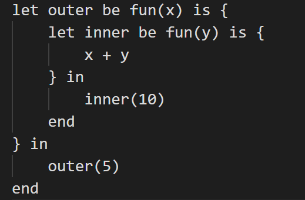
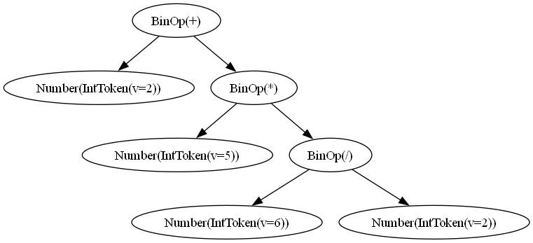

# 📖 Getting Started with Cobra
Welcome to Cobra, a powerful and expressive programming language that combines dynamic typing, lexical scoping, first-class functions, and structured syntax. This guide will help you write your first program and understand the core features of the language.

# Progress Overview

| Component                  | Status                     |
|----------------------------|----------------------------|
| Lexer                      | ✅ Completed               |
| Parser                     | ✅ Completed               |
| AST Generation             | ✅ Completed               |
| Type Checking              | ⏳ Partial Implementation  |
| Bytecode Generation (C)    | ✅ Completed               |
| Virtual Machine            | ⏳ In Progress             |
| Standard Library           | ⏳ Basic Features Implemented |


# Components Implemented

### Calculator with Arithmetic Operations
- Supports basic arithmetic operations: `+`, `-`, `*`, `/`.
- Parentheses for precedence handling.
- Uses Abstract Syntax Trees (ASTs) for efficient evaluation and optimization.

### Conditionals
- Implements `if-else` statements.
- Supports boolean expressions (`x > 5`, `y == 10`).
- Short-circuit evaluation for `&&` and `||`.

### Variables
- Supports variable declaration and assignment (`x = 10`).
- Symbol table for managing names, types, and memory locations.
- Currently supports global variables, with local scoping planned.

### Functions (Value-Returning)
- Basic function definitions and calls implemented.
- Supports single-parameter functions with return values.
- Function table tracks names, parameters, and return types.

### Loops
- **While Loop** implemented.
- Evaluates loop conditions and executes body until condition is `false`.
- Enables repetitive task execution.

### Lexical Scoping
- Symbol table supports hierarchical scopes.
- New scopes pushed onto a stack when entering blocks/functions.
- Variables resolved by traversing the scope chain.

### Print Functions
- AST tree image generation supported.
- Dedicated `print` function required for outputting results.

### Arrays
- Implemented support for arrays.
- Arrays can be indexed and iterated over using loops.

### Bytecode Generation
- Optimized AST-to-bytecode translation.
- Efficient bytecode execution for arithmetic, conditionals, loops, and functions.


# Basic Functionalities
## 🔢 Variables and Data Types
You don’t have to declare variable types explicitly.
```
let a be 0 in main end
```

## 🧮 Functions
```
fun(<arg>) is { body } 
```

## 🗂️ Scope and Lexical Scoping


# 🔄 Control Flow
```
if {a < b} then
    {"a is less than b"}
else
    {"a is not less than b"}
end
```

# 🔁 Loops
Loops allow repetitive execution of code. Cobra supports only while loops.
```
while {condition} do
    {body}
end
```


# Language Features

### First-Class Functions
- Functions can be assigned to variables, passed as arguments, and returned from other functions.
- Enables higher-order functions and modular programming.

### Lexical Scoping (Static Scope Resolution)
- Variables are resolved based on their position in the source code.
- Inner functions can access outer function variables but cannot modify them unless explicitly declared.

### Dynamic Typing
- Variables do not require explicit type declarations.
- Types can change during execution for flexibility.

### Scope Definition Using `()` and `{}`
- **Parentheses `()`**: Used for function arguments, conditionals, and loops.
- **Curly Braces `{}`**: Define explicit code blocks for structured programming.


# 👋 Your First Program
Lets now write our first program in Cobra 🐍.
```
let hello be "Hello, " in
    let world be "World!" in
        hello + world
    end
end
```


## Test Coverage

### Ease of Running Tests
- `run_tests.sh` runs all test cases.
- Uses `pytest` for frontend tests and `CUnit` for backend bytecode tests.

### Coverage & Quality
- **Lexer & Parser**: High coverage with various input cases.
- **Type System**: Needs more edge case tests.
- **Bytecode Execution**: Basic arithmetic and control flow tested.
- **Error Handling**: Needs dedicated tests for syntax errors and runtime exceptions.


# How to run
The code to be run needs to be added in code.txt and run from the main.py
The flow can be observed using the AST,



# Team Roles and Responsibilities

| Component                      | Responsible Members  | Description  |
|--------------------------------|----------------------|--------------|
| **Lexical Analysis (Lexer)**   | Aashmun & Dewansh   | Tokenizes source code. |
| **Parsing (Syntax Analysis)**  | Aashmun & Aayush    | Converts tokens to AST. |
| **Intermediate Code (IR)**     | Aayush & Bhoumik    | Translates AST to IR. |
| **Optimization**               | Aayush & Dewansh    | Improves performance. |
| **Code Generation (Backend)**  | Aayush & Dewansh    | Converts IR to bytecode/machine code. |
| **Semantic Analysis & Type Checking** | Aashmun & Bhoumik | Ensures type safety and scope rules. |
| **REPL & Execution**           | Yet to be completed | Interactive Read-Eval-Print Loop. |
| **Testing & Debugging**        | All Members         | Unit tests, integration tests. |
| **Documentation & Packaging**  | Aashmun & Aayush    | User-friendly documentation and packaging. |


<iframe src="https://docs.google.com/presentation/d/1M_ANAZm4amV9q1QWfF7wMY5ip1FoqRIlDIwmkreqP8w/edit#slide=id.p" width="800" height="450"></iframe>

#
This documentation will be updated as development progresses. 🚀